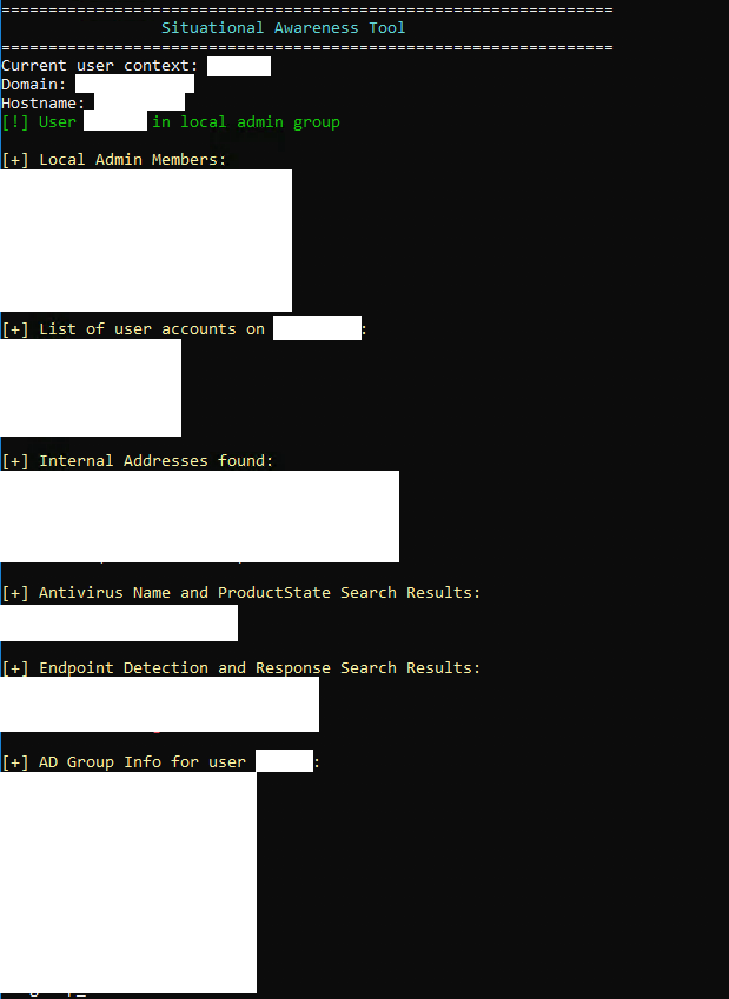

# Situational Awareness Tool (Windows)

This is a C# tool that uses .NET (rather than net user, net group, ipconfig, and other common command-line utilities) for gathering initial data of interest and situational awareness from a Windows host that an attacker gains access to. 
This tool can be run directly on the host (ex: via RDP) or remotely via attack tools (ex: Cobalt Strike's execute-assembly).

**Credit to Brandon Dennis (https://github.com/Slyth11907) for writing the .NET code to list DNS cache entries using dnsapi.dll.**

**Credit to HarleyQu1nn for EDR detection research that I leveraged and ported over to C# (https://github.com/harleyQu1nn/AggressorScripts/blob/master/EDR.cna)**

Once run this tool gathers the following information:

-local admin group members

-local user accounts

-internal IP addresses found

-antivirus products found (note: code invokes wmi for this check)

-endpoint detection & response products found

-list of AD groups belonging to the current user context (if joined to a domain)

-list of domain admin accounts (if joined to a domain)

-list of domain controllers (if joined to a domain)

-dump of DNS cache entries (using dnsapi.dll)

This tool was written as a Visual Studio Console App (.NET Framework) and uses .net for the checks above (except for using wmi to enumerate antivirus products)

-------
This code serves as a proof of concept for alternate methods of gathering Windows host data of interest using .NET.
